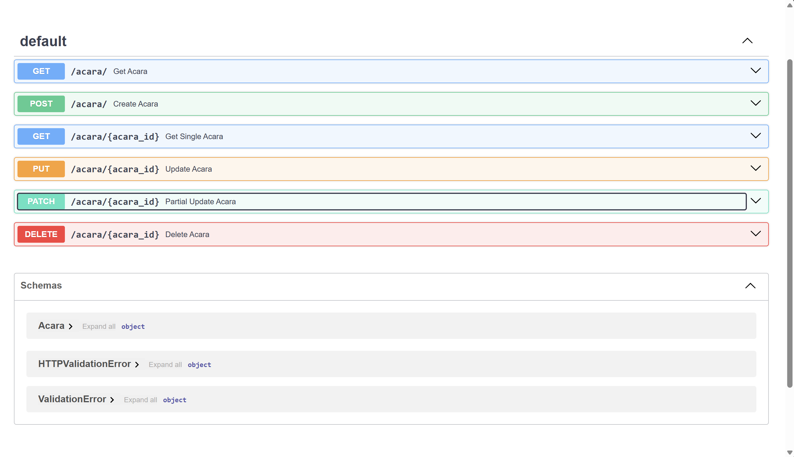

# Digi Sehat API
Sebuah Api untuk adalah backend sistem yang dirancang untuk daftar acara musik yang berlangsung dari data `.json`


## Daftar Isi
- [Tumpukan Teknologi](#tumpukan-teknologi)
- [Fitur](#fitur)
- [Dokumentasi Halaman](#dokumentasi-halaman)
- [Cara Instalasi](#cara-instalasi)
- [Cara Penggunaan](#cara-penggunaan)

## Tumpukan Teknologi
### Bahasa Pemograman
- **Python**: Bahasa pemrograman yang serbaguna dan mudah dipelajari, sering digunakan untuk pengembangan web, analisis data, kecerdasan buatan, dan automasi skrip

### API
- **Restful API**: gaya arsitektur perangkat lunak yang didasarkan pada prinsip-prinsip REST (Representational State Transfer). RESTful API dirancang untuk memfasilitasi komunikasi antara sistem-sistem yang berbeda secara efisien dan terstruktur menggunakan protokol HTTP.

- **Fast APi**:  kerangka kerja Python yang dirancang untuk membangun aplikasi web API dengan cepat.

### Format Data
- **JSON**: format pertukaran data yang ringan, mudah dibaca, dan mudah ditulis oleh manusia. Format ini didasarkan pada sintaks JavaScript, tetapi juga mendukung beberapa bahasa pemrograman lainnya, menjadikannya format yang populer untuk mentransfer data antar aplikasi.

## Fitur
- Melihat semua data acara festival
- Membuat data acara festival
- Update data acara festival
- Delete data acara festival

## Dokumentasi Halaman
##### 1. Halaman Utama

##### 2. Halaman List dan Skema APInya


## Cara Instalasi
```bash
# Pastikan Python 3.6+ sudah terinstal pada sistem Anda. Anda juga perlu pip untuk mengelola pustaka Python.

# Clone repository ini
git clone https://github.com/defrijay/pentas-seni-musik.git

# Masuk ke direktori proyek
cd pentas-seni-musik

# Jalankan server FastAPI menggunakan uvicorn
python -m uvicorn main:app --reload

# Masuk dengan url server
http://127.0.0.1:8000/docs

```

## Cara Penggunaan
Setelah server berjalan, Anda bisa mengakses dokumentasi API di http://127.0.0.1:8000/docs yang menyediakan antarmuka Swagger untuk mencoba API secara langsung.

